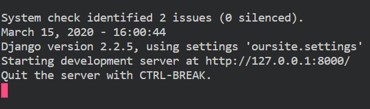
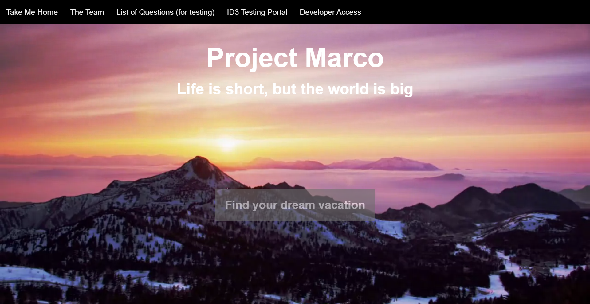
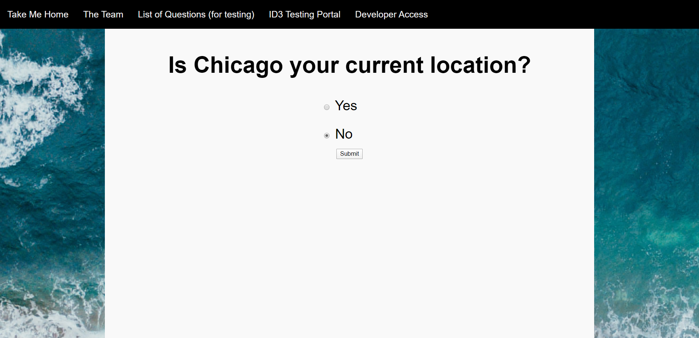
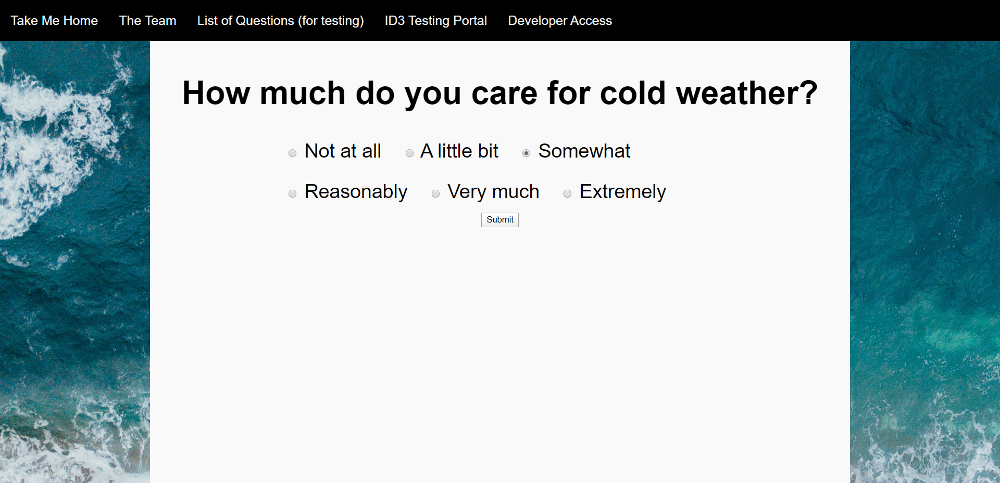
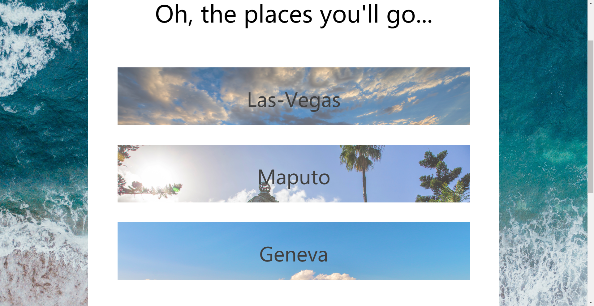

# Project Marco
Please use a markdown reader to read this document, your experience will be greatly enhanced by it.


Project Marco (named after the renowned explorer Marco Polo) is an application that 
hopes to make vacation planning easier for the indecisive or conflicted traveler. Roughly speaking, 
Marco assesses the vacation preferences of a user using an intelligently determined series of 
questions, and then returns a number of possible vacation locations that the user might
find interesting or suitable, alongside possible hotel and flight itineraries. Project Marco currently supports 
vacations to 240 cities, and hopes to add more in the future. 

To understand the motivation and some of the mechanics behind Marco, be sure to read through the presentation slides: `Screenshots and Project Related Images/CS 122 Final Presentation.pdf`

** IMPORTANT **
On the results page, please do not mouse over the text until the background picture has already loaded.     
Please do not click too rapidly or click submit buttons more than once.        
If the website gives an error, please try again by going back to the home page. During our testing, the program worked 10 times in a row and errors shouldn't be very common.    

## Getting Started

### Prerequisites
Project Marco is built using Python3 and Django Webserver. In order to run Marco, you will need to have the following python packages installed:
* `pandas`
* `scikit-learn`
* `selenium`
* `requests` 
* `Django`
* `django-widget-tweaks`
* `beautifulsoup4`
* `geopy`

Strictly speaking, not all of these packages are required, however some will be useful if you would like to take a look under the hood at certain aspects of the project. 

## Usage 
### Running Marco
Prior to running Marco, you will want to allocate a large amount of memory to your virtual machine. In particular, the graphical interface can be rather demanding at times.
To run Marco, first clone the repository using the command:

```
git clone https://mit.cs.uchicago.edu/achoudhary/CMSC-12200-Group-Project
```
After this navigate to the directory `CMSC-12200-Group-Project/oursite`. From here, run the command:
```
python3 manage.py runserver
```
You will see the prompt:    
    
From here, you can use ctrl/cmd + leftclick to acess the website. 

### Navigating Marco
In order to navigate Marco, first click the button that reads "Find your dream vacation":



From here, you will be lead to a series of predetermined questions regarding logistics for the trip you are planning. These questions are:

* Is your current location Chicago?
    * If not, what is your current location? (This answer will be pre-filled by the output of a location API. Feel free to manually override it if you wish).
* What are your intended departure and arrival dates? Currently the application only supports dates in the years 2020,2021.
* How many individuals are you travelling with?
* How many hours would you be willing to travel on a plane?


An example prompt (for location) looks like this:



Once these questions are answered, the site will move to a series of dynamically determined and ordered questions, generated by a trained decision tree.
Note that this decision tree is trained using **synthetic** training data. This training data is generated using Monte Carlo sampling of scores, and operates 
under the assumption that scores are normally distributed. For more information on location scoring and decision tree construction, see the files `cluster_score.py` and `vacation_id3_attempt_2.py`



These questions will continue until the user reaches a final question, which will be apparent by the loading time. After the loading completes, the user will 
be presented with their vacation results.



These results will include the location itself, alongside a brief blurb (sourced from LonelyPlanet) about the location, as well as booking information
for a hotel and flight to the location, sourced from tripadvisor and kiwi.com respectively. To view these further results, mouse over your location of interest. The results look like this:


The flight information is organized in the form of Leg: Departure Destionation -> Arrival Destination (Flight No.). Each Leg represents one connection in the given journey. The total flight duration
and price are listed, alongside a booking link, should you wish to book your vacation. The background image is an image of the location retrieved from LonelyPlanet

## Directories and Source Code

Here we will list some information for particularly relevant files and source code.

###  Main Directory:
* `trip_advisor_consts.py` - Clusters attractions based on trip advisor keywords.
* `trip_advisor_consts.py`
* `cluster_score.py` - Computes scores for each location based on its top-30 attractions (by tripadvisor ranking) and bins spsecified in `trip_advisor_consts.py`. See file docstring for more scoring information.
* `weather_data.py` - Retrieves weather information for given cities.
* `vacation_id3_attempt2.py` - Builds and Train decision tree, given scores computed in `cluster_scores.py` and features/bins specified in `trip_advisor_consts.py`. 
* `kiwi.py` - Retrieves Flight Information from the kiwi.com flights API.
* `full_country_score.py` - Associated scoring information for each country, collected from `cluster_scores.py`. 
* `hotels.py` - Retrieves hotel and location attraction data using the TripAdvisor Travel API.

### `Screenshots and Project Related Images/`
Contains images related to project, as well as the project presentation.


### `Preprocessing/`

The files in this folder are scripts related to processing and obtaining the static data for the project, for example, data that does not change for say, five years in time. One example of this is attractions 
data: a reasonable assumption is that the attractions that make a city famous now will make it famous in the near future. All of this data is processed in this folder.

### `Scraping/` 

The files in this folder are scripts and data related to the webscraping portion of the project. In particular, they contain data acquired from scraping the LonelyPlanet website. Some important files in this folder are:
* `scrape_city_links.py` -- Scrape city links from Lonely Planet
* `scrape_city_pages.py` -- Scrape info from city pages on Lonely Planet 

### `oursite/` 

These files and associated directories are those required to build a Django website. These files contain a local copy of certain files in the main directory so that they can be accessed by the Django website.  Moreover, the following files are rather important for the correct functioning of the website.

* `/question/views.py` - Script that renders HTML pages. 
* `/question/models.py` - Contains models for each page.
* `/templates/` - Contains stylistic templates for each page.


## Future Additions
As a team, we have thought of many future additions and improvements for this project. Most can be found in the final slides of `Screenshots and Project Related Images/CS 122 Final Presentation.pdf`. Here are the improvements we feel would be particularly benefical:
* Diversification of Data Sources - Use more APIs and websites to obtain information.
* Restructuring of Features/Bins - Make these bins more or less granular, based on user's taste.
* Training of the Decision Tree - Find users who would be willing to score locations.
* Scoring System - Compare and contrast different methods of scoring locations and decaying based on relative popularity.
* UI/UX - Spend more time polishing the UI/UX, and speeding up the Django website. 
* Stability - Currently, due to our method of crawling a decision tree, we sometimes encounter recursion stack issues. Finding a different structure (perhaps a non-recursive one) would help in this 